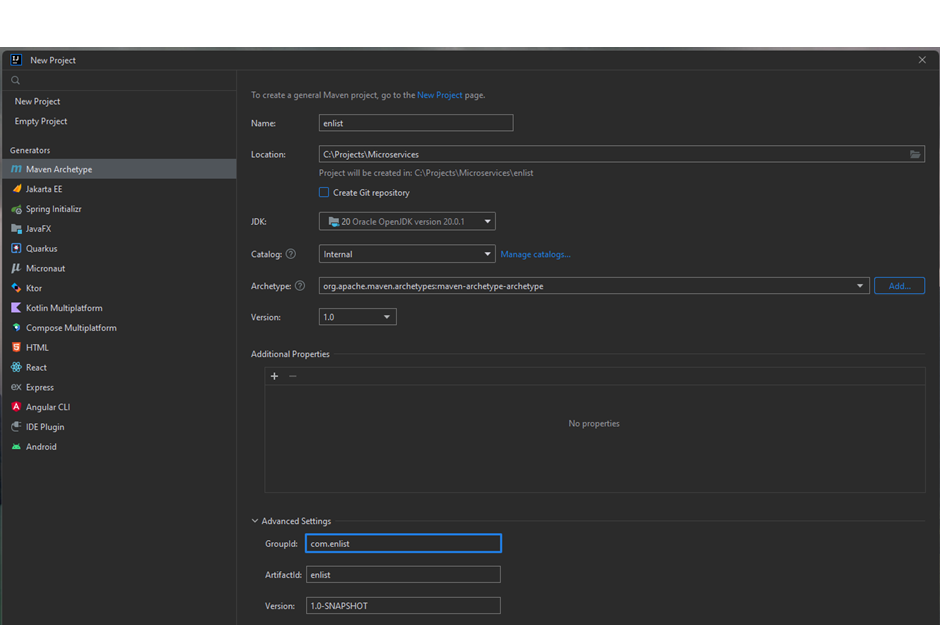
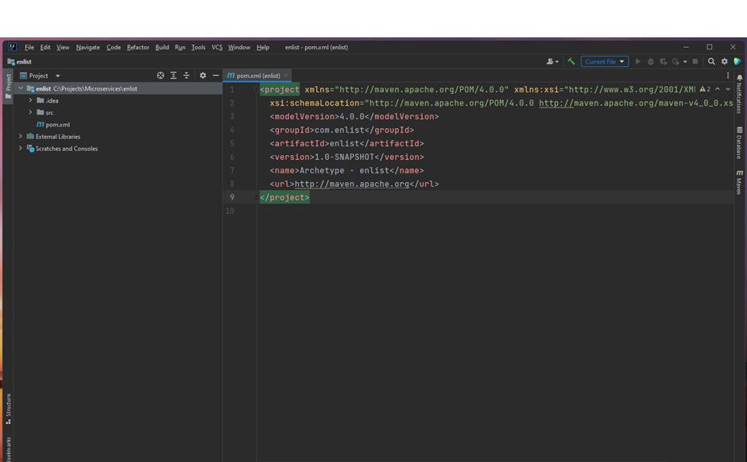
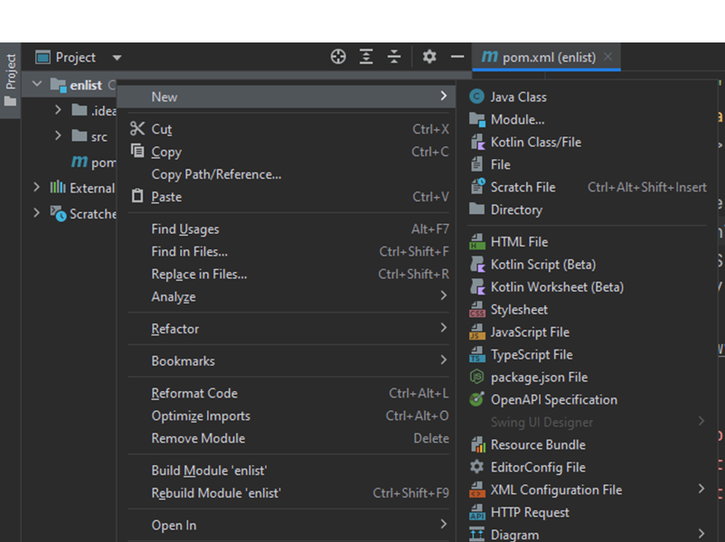
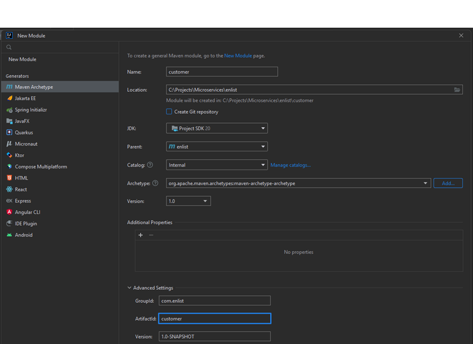
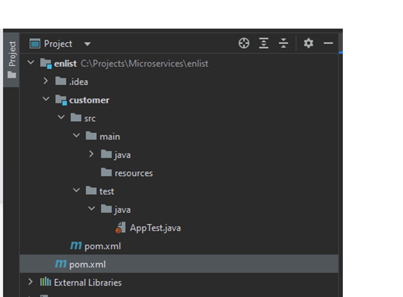
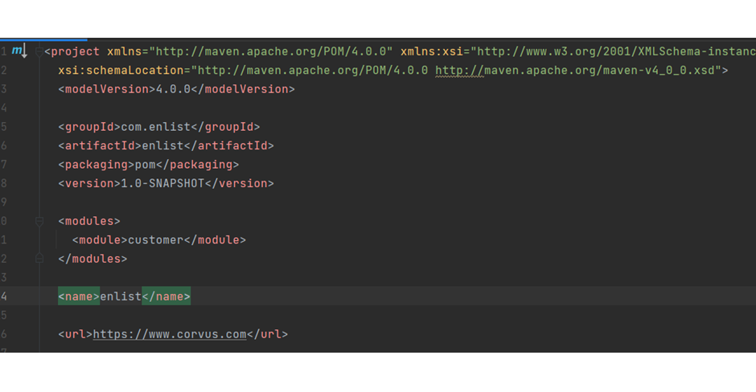
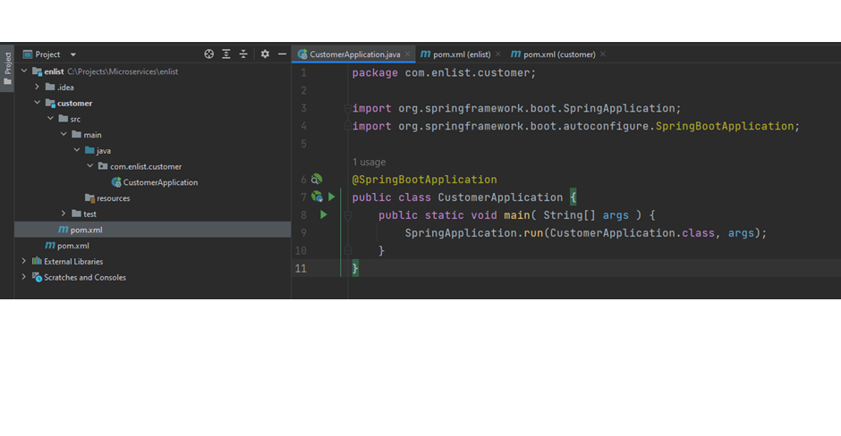
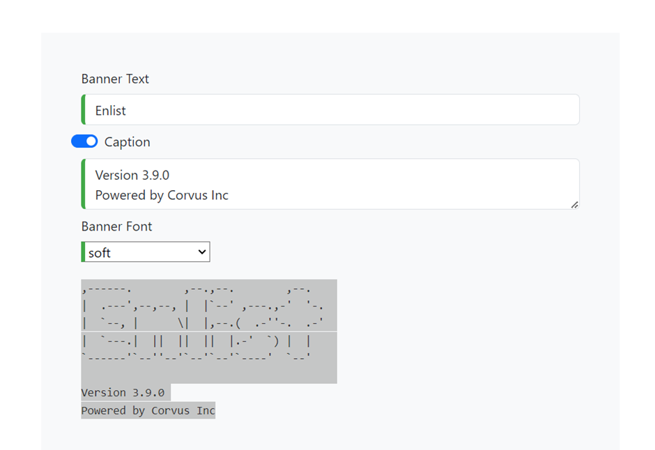
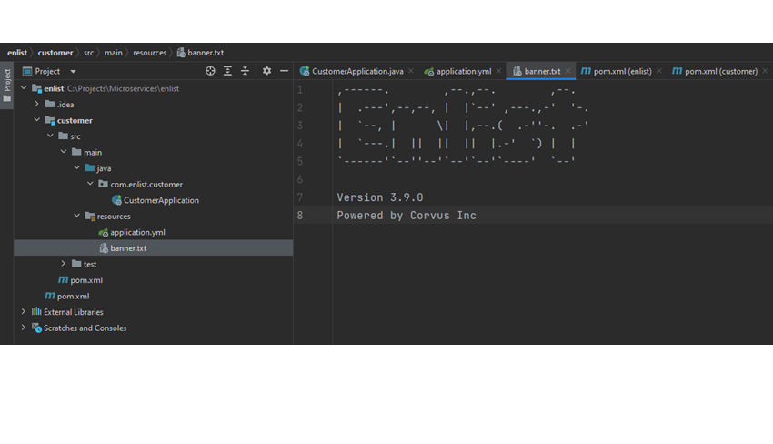
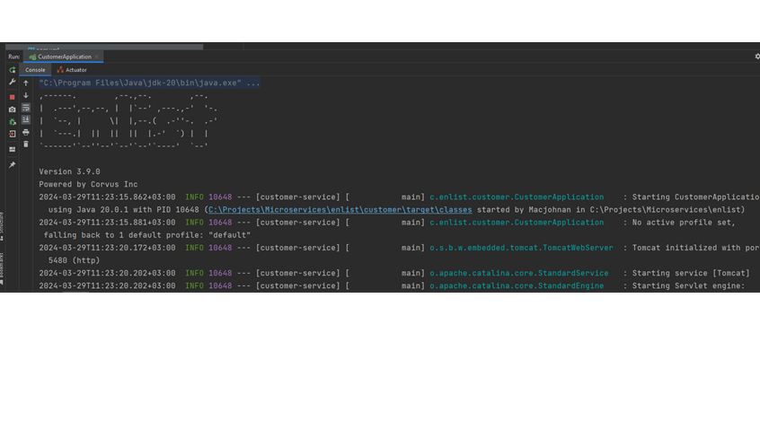

# Building Microservices with Spring Boot
## Introduction
This project serves as a comprehensive guide to building microservices leveraging cutting-edge frameworks. Embracing the Aggregator design pattern, it provides an insightful exploration into modern microservices architecture. Key topics covered include containerization with Docker, seamless service discovery implementation, robust integration of message queues using RabbitMQ, alongside a myriad of other essential microservices paradigms.
## Project Overview
The project is a customer enlisting service and includes services that capture required documents for enlisting and the organization that they are affliated to. The two services are aggregated to a single service called UIFeed that connects the clients to the microservices
## Creating the project
We start by creating the root project for our project. We'll be creating a Maven project using the IntelliJ IDE



This will create a root project for our so let it install the dependencies required. Once we’re done, our project structure will look like this:



Since this is our root project, we do not need the src folder so we need to delete it out
## Modifying Project Configuration
Next, we’ll modify our pm.xml file to create both dependency management for shared dependencies in all our microservices from the root project and also include other dependencies that each microservice will have in their pom.xml file, So we modify the pom.xml file to look like this:
## Maven Project Configuration
````
<project xmlns="http://maven.apache.org/POM/4.0.0" xmlns:xsi="http://www.w3.org/2001/XMLSchema-instance"
  xsi:schemaLocation="http://maven.apache.org/POM/4.0.0 http://maven.apache.org/maven-v4_0_0.xsd">
  <modelVersion>4.0.0</modelVersion>

  <groupId>com.enlist</groupId>
  <artifactId>enlist</artifactId>
  <version>1.0-SNAPSHOT</version>
  <name>enlist</name>
  <url>https://www.corvus.com</url>
  <properties>
    <java.version>22</java.version>
    <spring.boot.maven.plugin.version>3.2.4</spring.boot.maven.plugin.version>
  </properties>
  <dependencyManagement>
    <dependencies>
      <dependency>
        <groupId>org.springframework.boot</groupId>
        <artifactId>spring-boot-dependencies</artifactId>
        <version>3.2.1</version>
        <type>pom</type>
      </dependency>
      <dependency>
        <groupId>org.springframework.boot</groupId>
        <artifactId>spring-boot-starter-web</artifactId>
        <type>pom</type>
      </dependency>
    </dependencies>
  </dependencyManagement>

  <dependencies>

    <dependency>
      <groupId>org.projectlombok</groupId>
      <artifactId>lombok</artifactId>
      <version>1.18.32</version>
    </dependency>
    <dependency>
      <groupId>org.springframework.boot</groupId>
      <artifactId>spring-boot-starter-test</artifactId>
      <version>3.2.4</version>
    </dependency>
    <dependency>
      <groupId>org.modelmapper</groupId>
      <artifactId>modelmapper</artifactId>
      <version>3.1.1</version>
    </dependency>
    <dependency>
      <groupId>org.apache.commons</groupId>
      <artifactId>commons-lang3</artifactId>
      <version>3.14.0</version>
    </dependency>
    <dependency>
      <groupId>ch.qos.logback</groupId>
      <artifactId>logback-classic</artifactId>
      <version>1.5.3</version>
    </dependency>
    <dependency>
      <groupId>org.hibernate.validator</groupId>
      <artifactId>hibernate-validator</artifactId>
      <version>8.0.1.Final</version>
    </dependency>
    <dependency>
      <groupId>org.postgresql</groupId>
      <artifactId>postgresql</artifactId>
      <scope>runtime</scope>
      <version>42.6.2</version>
    </dependency>
  </dependencies>
  <build>
    <pluginManagement>
      <plugins>
        <plugin>
          <groupId>org.springframework.boot</groupId>
          <artifactId>spring-boot-maven-plugin</artifactId>
          <version>${spring.boot.maven.plugin.version}</version>
        </plugin>
      </plugins>
    </pluginManagement>
  </build>

</project>
````
## Creating Microservices
Next, we’ll create our microservices starting with the customer microservices. Right click the enlist project, choose New and Module. 

We’ll create a customer service with these details

Click, Next and leave the Maven version the same. Do not add any dependencies. Click create to add the project

In our project root pom.xml file a new module node is added with the customer service name

Next, we need to add the dependency for spring-boot-starter-web for the customer service
````
<project xmlns="http://maven.apache.org/POM/4.0.0" xmlns:xsi="http://www.w3.org/2001/XMLSchema-instance"
         xsi:schemaLocation="http://maven.apache.org/POM/4.0.0 http://maven.apache.org/maven-v4_0_0.xsd">
    <parent>
        <artifactId>enlist</artifactId>
        <groupId>com.enlist</groupId>
        <version>1.0-SNAPSHOT</version>
    </parent>
    <modelVersion>4.0.0</modelVersion>
    <artifactId>customer</artifactId>
    <name>customer</name>
    <url>http://maven.apache.org</url>
    <dependencies>
        <dependency>
            <groupId>org.springframework.boot</groupId>
            <artifactId>spring-boot-starter-web</artifactId>
            <type>pom</type>
        </dependency>
    </dependencies>
</project>
````
## Creating Customer Service Classes
First we will add a new package in the java package of the customer service called com.enlist.customer and in there we’ll create our CustomerApplication class that contains the main method

In our resource folder, we will add the application.yml file, however you can use properties for configurations if i t serves you better. Right click the resource folder and choose New >> File and add that file name. Set the details of the file to:
````
server:
  port: 5480

spring:
  application:
    name: customer-service
````
Mind the indentation so the file does not have errors.
## Create Banner for your service
In addition, we will add a spring boot banner file in the resource folder. So again, right click the resource folder and choose New >> File and add a banner.txt file.
Open Google and search for ‘create spring boot banner’ and click on ‘spring boot banner’ generator’. Generate banner by filling in details

Copy everything and page in your banner file

Run the customer service and you will see in the Run window this:

## Creating Models
Next, we want to create the models for our customer service. We will create a new package called com.enlist.customer.models and in there we’ll create our Customer entities with their inheritances.

````
//DomainEntity – base class for all entities
package com.enlist.customer.models;

import jakarta.persistence.Column;
import jakarta.persistence.GeneratedValue;
import jakarta.persistence.GenerationType;
import jakarta.persistence.Id;

public abstract class DomainEntity {
    @Id
    @GeneratedValue(strategy = GenerationType.IDENTITY)
    //@JdbcTypeCode(SqlTypes.BIGINT)
    private long id;

    @Column
    private boolean is_deleted;

    @Override
    public String toString() {
        return id != 0 ? String.format("Entity ID: %s", id): super.toString();
    }

}
````
````
//Customer – Base class for all customer types
package com.enlist.customer.models;

import jakarta.persistence.Column;

public class Customer  extends DomainEntity {
    @Column(nullable=false)
    private long org_id;

    @Column(length = 220, nullable=false)
    private String address;

    @Column
    private CustomerType cus_type;

    @Column(length = 220, nullable=false)
    private String email;

    @Column(length = 25, nullable=false)
    private String phone;

    @Column(length = 40, nullable=false)
    private String account;

}
````
````
//Person – Class for customers of type individual customers
package com.enlist.customer.models;

import jakarta.persistence.Column;
import lombok.*;

@Data
@Builder
@EqualsAndHashCode(callSuper = false)
public class Person extends Customer {
    @Column(length = 40, nullable=false)
    private String first_name;

    @Column(length = 40, nullable=false)
    private String middle_name;

    @Column(length = 40, nullable=false)
    private String last_name;

}
````
````
//Business – Class for customers of type Business customers
package com.enlist.customer.models;

import jakarta.persistence.Column;
import lombok.*;

@Data
@Builder
@EqualsAndHashCode(callSuper = false)
public class Business extends Customer {
    @Column(length = 220, nullable=false)
    private String business_name;
}
````
````
//Affiliation – Class for organization that the customer is attached to
package com.enlist.customer.models;

import jakarta.persistence.Column;
import lombok.*;

@Data
@Builder
@EqualsAndHashCode(callSuper = false)
public class Affiliation extends DomainEntity {
    @Column(length = 200, nullable=false)
    private String org_name;

    @Override
    public String toString() {
        return (org_name != null && !org_name.isEmpty()) ?
                String.format("%s", org_name):
                super.toString();
    }
}
````
## Creating Request Objects
Next, we’ll need to create request objects that will be used by our end points. We’ll create three request objects of type Record:
````
//IndividualRequest – Request record for individual customers
package com.enlist.customer.requests;

public record IndividualRequest(
        String firstName,
        String middleName,
        String lastName,
        String address,
        String email,
        String phone,
        int type,
        int affiliation) {
}

//BusinessRequest – Request record for business customers

package com.enlist.customer.requests;

public record BusinessRequest(
        String businessName,
        String address,
        String email,
        String phone,
        int type,
        int affiliation) {
}

//AffiliationRequest - Request record for affiliation organizations

package com.enlist.customer.requests;

public record AffiliationRequest(String name) {
}
````
## Creating Customer Service
Next, we’ll create a customer service to help use process our requests to the database. We’ll create an object of type Record that looks like this:

````
package com.enlist.customer.services;

import com.enlist.customer.models.Affiliation;
import com.enlist.customer.models.Business;
import com.enlist.customer.models.CustomerType;
import com.enlist.customer.models.Person;
import com.enlist.customer.requests.AffiliationRequest;
import com.enlist.customer.requests.BusinessRequest;
import com.enlist.customer.requests.IndividualRequest;
import org.springframework.stereotype.Service;

@Service
public record CustomerService() {
    public void onBoardIndividual(IndividualRequest request) {
        Person person = Person.builder()
                .first_name(request.firstName())
                .middle_name(request.middleName())
                .last_name(request.lastName())
                .cus_type(CustomerType.fromValue(request.type()))
                .org_id(request.affiliation())
                .email(request.email())
                .phone(request.phone())
                .address(request.address())
                .is_deleted(false)
                .build();
    }

    public void onBoardBusiness(BusinessRequest request) {
        Business person = Business.builder()
                .business_name(request.businessName())
                .cus_type(CustomerType.fromValue(request.type()))
                .org_id(request.affiliation())
                .email(request.email())
                .phone(request.phone())
                .address(request.address())
                .is_deleted(false)
                .build();
    }

    public void addAffiliation(AffiliationRequest request) {
        Affiliation org = Affiliation.builder()
                .org_name(request.name())
                .build();
    }
}
````
## Creating Controllers
Next, we want to start adding controllers to our service. We’ll add a new package called com.enlist.customer.controllers and we add two controllers CustomerController and AffiliationController


